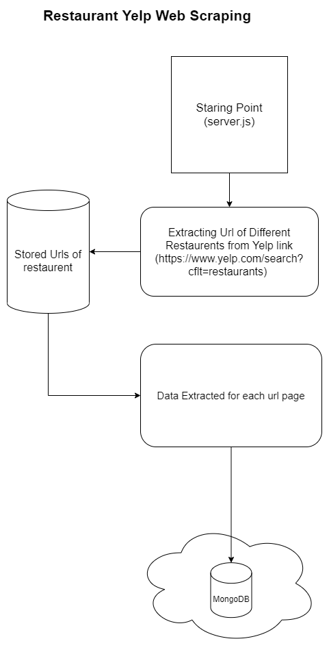

# restaurants-yelp-eatoes

A Nodejs Application to extract information of different restaurants listed on yelp

### Setting up the project on your local machine:

- Download the Project on you computer (Download "main" branch , Dont download "feature" branch).
- Change the MongoDB Uri String in the .env file and create a database "resdata" and a collection "restaurents".
- Inside Your project Run command : npm start
- That's it !, your program is all setup.

### Dependencies and tool used:

- Mongoose (Mongo Framework)
- MongoDB (For Storage)
- cheerio (For Parsing HTML String)
- request-promise (For Requesting Page Content)
- Xpath Finder (To get path of a Particular element on the page)
- dotenv to generate env variable

### Working

One you start the application ( entry point server.js ) this application will start storing url links of different restaurants after that it will go to each restaurant's page and store data like name, location, etc.
Finally storing all the data to mongoDB (Note: you can also use mongoDB Atlas for cloud Storage)

### Project Structure

### Constrains

Because Extracting so much data require a lot of processing time and other resources, this can lead to slow runtimes thus for development purpose the limit is set to 50 restaurents.
However you can remove this limitation by changing the value of target variable in the server.js file to 200
